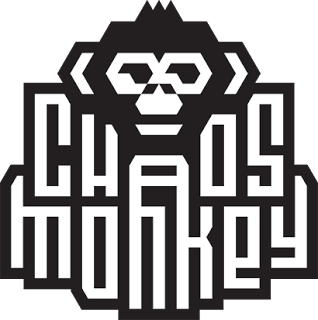

# Curiosity Report

### Max Gollaher

---

## How Netflix does their DevOps

In 2008, Netflix had a database corruption that prevented them from delivering DVDs to their members. Due to this outage,
Netflix moved their services to the cloud, and chose AWS to partner with them. Rewriting their entire application to become
completely cloud-native.

Rather than focusing on a self-hosted relational database, Netflix moved to develop using a NoSQL database with AWS.

With less focus on maintaining a self-hosted database, Netflix was able to allocate resources to providing a better product,
which allowed teams to build and push changes faster, and help Netflix grow to the giant that it is today.

## Chaos Monkey

Because of the outages in 2008 that almost killed the company, Netflix built tools to help them prepare for and survive unexpected
outages. Chaos Monkey is a tool created by Netflix that randomly kills production instances and services, helping developers lean to
react to outages, and find weaknesses in their systems.

Chaos Monkey features:

- Random failure injection
- Fault tolerance testing
- Automated testing
- Customized chaos
- and Cloud-native support

This tool started a new form of testing, Chaos Engineering, and Netflix found huge success in Chaos Monkey that they then developed a series
of other "monkeys," known as the Simian Army

## Simian Army

The Simian Army is mainly made up of the Chaos Monkey, as mentioned above, a Janitor Monkey, and Conformity Monkey.

The Janitor Monkey runs in AWS, looking for resources to clean up. It automatically looks for instances that are no longer being used, and
cleans them up, helping to optimize resource usage and reduce waste. It works in a process of "mark, notify, and delete," finding resources to mark
for deletion, scheduling a time to delete the resource. After marking a resource for deletetion, it notifies engineers, and deletes the resource after a
scheduled period.

Conformity monkey enforces best practices and operational rules across Netflix's systems. It prevents misconfigurations that could lead to vulnerabilities
or outages.

These three monkeys, along with other tools developed by Netflix, create a pretty robust process of DevOps and QA at Netflix, cycling between automated
chaos tests, learning and fixing vulnerabilities, decreasing waste, and enforcing standards to prevent future outages has lead Netflix to be able to grow
massively, with servers able to withstand pretty much anything that is thrown at them.

## Spinnaker

Netflix also developed Spinnaker, which is a delivery platform which allows for fast an reliable software releases. During my time in this course, using Github actions
to release code was complicated to release to just one server on AWS. But with Spinnaker, which integrates with AWS, I would have been able to deploy to thousands of
different servers within minutes. Spinnaker also allows for different deployment strategies, such as blue-green deployments and rolling updates.

## Work Culture

Prior to 2008, Netflix had siloed teams, with an ops team, development team, QA team, etc. This type of work environment slows down development dramatically, requiring teams to communicate effectively with eachother, bottlenecking the speed at which code could be released.

Since then, Netflix has opted to adopt an "operate what you build" model, with smaller teams, made up of different engineers, each with different responsibilities, a single team is able to take ownership of developing, testing, and releasing their own code. This allows for greater communication and speed in development, while enhancing the effectiveness of QA testing.

## Conclusion

Netflix's journey from a primitive development infrastructure to a cloud-native, devOps world leader highlights the importance of building and testing reliable systems. Their tools, Chaos Monkey, Janitor Monkey, Conformity Monkey, Spinnaker, and opting for an "operate what you build" model, all allow Netflix to have agile code development, while simultaneously rigourously testing their code and systems, preparing for inevitable outages and creating safeguards against those. Their approach should be an example for modern companies seeking to level up their DevOps practices.
